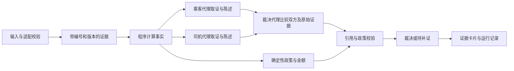

# Ryde 原型结构优化建议

2026-10-07 · T012 · 负责人建议，交给 WorkBuddy 分轮执行；本轮没有改动产品代码。以 S1 `6d7ad6d` 的实际原型为基础。进度与缺陷证据只维护在 [T012](../tasks/T012-structure-handoff.md)，开源依据只维护在 [来源](../sources/2026-10-07-open-source-patterns.md)。

## 目标与选择

保持两类纠纷、Rider Advocate／Driver Advocate／Judge、FastAPI、Python 3.10+ 与无构建前端。让评委看见每个代理读取了什么、提交了什么主张、哪些证据与政策决定最终结果；规则和金额仍由程序控制。

三个选择：仅美化现有页面最快，但不能修补数据与解释矛盾；迁移 LangGraph 加 React 能获得更多组件，但迁移和回归成本过高；推荐在现有模块旁补小型契约、校验和运行事件。已有三处 LLM 调用应改进，不从零重写三个代理。

## 目标流程

三代理是有边界的工作流。先允许双方各完成一次结构化陈述、Judge 比较双方；同一轮失败最多修复重试一次，不增加无限辩论。扩展到一次补证应另开任务，不是第一轮默认范围。

## 按职责增量整理目录

标为“新增”的路径在当前 S1 中尚不存在，按所属批次才创建，不提前堆空文件。

| 路径 | 职责与调整 | 批次 |
|---|---|---|
| backend/adapters/official_ticket.py、backend/schemas.py | 外部格式与内部格式校验；保留未知和缺失，错误输入给 422 | WB01 |
| backend/core/evidence.py、policy.py | 保留现有事实计算与规则；缺少影响金额的输入不得变成 0 元成功裁决 | WB01 |
| frontend/index.html | 首轮只修缺值展示和真实状态；后续再拆展示代码 | WB01 |
| backend/contracts.py（新增） | EvidenceItem、AgentClaim、LLMResult、RunEvent、GuardResult 类型，避免输入 schema 与运行输出混杂 | WB02 |
| backend/core/guard.py（新增） | 校验引用归属、有效政策、动作与金额；产出最终可发布结果 | WB02 |
| backend/core/llm.py、agents/base.py | 单次调用结果含模式、错误、耗时、prompt版本；保持原有 provider | WB02 |
| backend/prompts/rider.md、driver.md、judge.md（新增） | 按现有 PROJECT_RULES 的 name/version/purpose 与占位符管理提示词 | WB02 |
| backend/agents/advocates.py、judge.py | 各自输入和输出边界；Judge 读取双方结构化主张及引用原文 | WB02 |
| backend/core/events.py、tools.py（新增） | 记录真实工具调用、结果与阶段；工具只读本案白名单材料 | WB03 |
| backend/agents/orchestrator.py | 编排顺序与有界失败；把事件立即交给事件记录器 | WB03 |
| frontend/app.js、styles.css（按需新增） | 从 index.html 提取代码与样式，不引入打包系统；工具卡片和引用定位 | WB03 |
| tests/ 与 sample_data/evaluation/（后者新增） | 既有测试保留；增加独立预期结果和案例对比 | WB04 |

不机械搬迁已有 core/agents，不增设微服务、向量数据库、账号体系或真实支付。Fraud 与 Precedent 已有代码保留，但不扩大投入；历史风险提示不代替本案事实。

## 核心契约与失败边界

1. **证据**：EvidenceItem 至少含 id、case_id、source、source_path、version、value、observed_at（未知可空）、is_simulated。政策含 id、version、来源和适用范围。外部原文只是数据，不能更改规则。
2. **代理输出**：AgentClaim 含 party、claims[{text,evidence_ids,policy_ids}]、missing_evidence、proposed_action。任何引用不存在、跨案件或不适用都不能进入最终说明。金额不作为代理可决定的字段。
3. **调用状态**：LLMResult 含 mode=llm/fallback、status、model、prompt_version、latency_ms、error_code；HTTP 成功但 JSON 无效或引用校验失败仍标 fallback。健康接口是服务状态，不能用最后一次成功掩盖同轮其他代理失败。
4. **最终裁决**：GuardResult 明确 approved/rejected、reasons、final_action、final_amount、policy_version。金额只来自确定性政策结果；最终Judge说明中的动作、数字、政策和证据引用都要匹配最终结构化结果。双方代理可以提出相反的proposed_action，但事实和引用仍须校验。无法可靠核验的最终自由文本退回由已验证事实构造的说明；nonce 和分隔符只是隔离措施，不是安全保证。
5. **事件**：RunEvent 至少含 run_id、seq、parent_id、actor、kind、status、started_at、duration_ms、evidence_ids、input_summary、output_summary、mode。只在真实动作发生时记录，日志不含密钥、私有思维链或完整敏感资料。

WB02 的独立完成条件：三代理各有可验证的结构化调用结果；故障可见；改变 LLM 的口头退款建议不会改变程序金额或污染最终解释。先保留同步 resolve 接口。

WB03 再增加 run_id 和事件传输。可用 FastAPI 现有 StreamingResponse 传 SSE，或轮询已发生的事件；若需要刷新后续看，使用标准库 SQLite 或本地 JSONL（二选一，先写清持久化边界）。保留 /api/resolve 兼容现有测试。需要单独验证事件在裁决结束前到达；事后播放须标“运行回放”。

## 界面与演示

案件工作区保持三个重点：左侧案卷与证据，中央双方主张和步骤，右侧裁决与依据。每条主张引用可打开原始证据；工具卡片展开显示输入、结果、耗时及失败原因；颜色外同时显示文字状态。

最有价值的后续演示是“同案新增证据后重新裁决”：保留 case_id，生成新的 evidence_version 与 run_id；仅增加一条事先标为模拟的关键证据，用同一政策比较结果和引用变化。不强制结论翻转，也不能为了好看调规则。先验证政策对该新增证据确实敏感，再选择演示案例。

## 执行次序与取舍

WB01 完成 S1 收尾 → 我审查报告与差异 → WB02 输出契约和校验 → 我验收 → WB03 可观察过程与页面 → WB04 评测与演示。首轮详见 [WorkBuddy 任务包](../tasks/WB01-reliability.md)。这些批次细化原 S1–S3 的内容，不重新启动 S0，也不把原冲刺截止日期视为本轮重新核验的赛事事实。

时间不足先砍恢复能力、同案对照和额外风格装修。两类稳定端到端、三个代理真实调用、正确引用与金额、诚实模式标识、实际工具使用证明优先。真实模型验证依赖团队可用 API；无 key 测试通过只证明 fallback，不能写成真实模型已验收。
